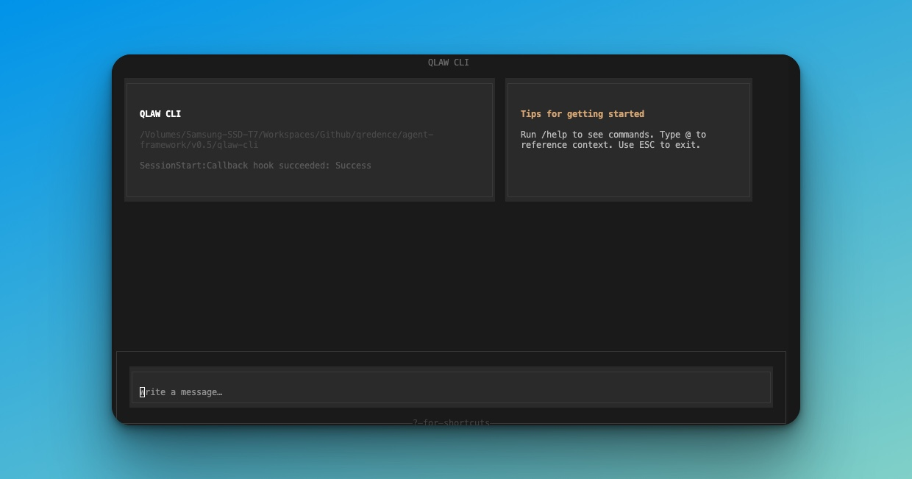

# qlaw-cli

[](https://opensource.org/licenses/MIT)
[](https://github.com/Qredence/qlaw-cli/releases)
[](CONTRIBUTING.md)
[](https://bun.sh)
[](CODE_OF_CONDUCT.md)



> A modern, feature-rich terminal UI chat application with OpenAI integration, built with OpenTUI and React.

**👉 New here? Start with the [Quick Start Guide](./docs/QUICKSTART.md)** | ✋ Read our [Code of Conduct](CODE_OF_CONDUCT.md) before contributing

## ✨ Features

### Core Capabilities

- 🤖 **OpenAI/Azure Integration** - Streaming responses with OpenAI and Azure OpenAI support
- 💬 **Session Management** - Multiple conversations with persistent history
- ⚡ **Command System** - 10+ built-in commands + custom command support
- 🏷️ **Smart Mentions** - Context, file, code, and docs references
- 🎯 **Autocomplete** - Fuzzy suggestions with keyboard navigation
- 🎨 **Themes** - Light/Dark toggle
- 💾 **Settings Persistence** - Preferences saved across sessions

### User Experience

- 🎨 **Claude Code-Inspired Design** - Clean, professional interface with warm accents
- 📱 **Fully Responsive** - Adapts to any terminal size
- ⌨️ **Keyboard-Driven** - Efficient workflows without leaving the keyboard
- 📜 **Smart Scrolling** - Auto-scroll with visual feedback
- 🔧 **Overlay Menus** - Settings and session list overlays

### Built-in Commands

`/clear`, `/help`, `/model`, `/endpoint`, `/api-key`, `/status`, `/settings`, `/sessions`, `/commands`, `/export`, `/theme`, `/terminal-setup`, and more

## 🚀 Quick Start

### Installation

**Install from npm:**

```bash
npm install -g qlaw-cli
```

**Or using other package managers:**

```bash
# Using yarn
yarn global add qlaw-cli

# Using pnpm
pnpm add -g qlaw-cli

# Using bun
bun add -g qlaw-cli
```

Then run from anywhere:

```bash
qlaw
```

### Development Setup

If you want to contribute or develop locally:

```bash
# Clone the repository
git clone https://github.com/Qredence/qlaw-cli.git
cd qlaw-cli

# Install dependencies
bun install

# Copy environment template
cp .env.example .env

# Add your OpenAI API key to .env
# OPENAI_API_KEY=your-key-here

# Run locally
bun run start

# Or with auto-reload during development
bun run dev
```

## 📖 Usage

### Getting Started

1. **Type your message** in the input field
2. **Press Enter** to send
3. **AI responds** with streaming support
4. **Use commands** by typing `/` for quick actions
5. **Add mentions** by typing `@` for context

### Commands

Type `/` to see available commands:

- `/clear` - Clear chat history (with confirmation)
- `/help` - Show help information
- `/model` - Set the model name
- `/endpoint` - Set the API endpoint base URL
- `/api-key` - Set the API key (masked in status)
- `/status` - Show current configuration
- `/settings` - Open settings menu
- `/sessions` - View recent sessions
- `/commands` - List custom commands
- `/export` - Export current chat to JSON
- `/theme` - Toggle light/dark theme
- `/terminal-setup` - Terminal keybinding tips

### Mentions

Type `@` for contextual references:

- `@context <text>` - Add contextual information to your message
- `@file <path>` - Reference a file in your message
- `@code <snippet>` - Include a code snippet in your message
- `@docs <topic>` - Reference documentation in your message

Mentions are automatically formatted to provide structured context to the AI. For example:
- `@docs API authentication` will format as a documentation reference
- `@file src/index.ts` will format as a file reference
- `@code function example() { return true; }` will format as a code snippet

### Keyboard Shortcuts

- `↑` `↓` - Navigate suggestions
- `Tab` - Autocomplete suggestion
- `Enter` - Send message / Select suggestion
- `Esc` - Cancel input / Close overlays / Exit
- `Ctrl+C` - Force exit

## 📚 Documentation

- **[Quick Start Guide](./docs/QUICKSTART.md)** - Get up and running in 3 minutes
- **[Architecture](./docs/ARCHITECTURE.md)** - Technical design and structure
- **[UI Reference](./docs/UI-REFERENCE.md)** - Visual interface guide
- **[Design System](./docs/DESIGN.md)** - Colors, typography, and components
- **[Changelog](./docs/CHANGELOG.md)** - Version history
 - **[API Integration](./docs/API-INTEGRATION.md)** - Configure OpenAI/Azure/custom backends
 - **[Agent Bridge Example](./bridge/README.md)** - Python Agent Framework bridge used by AF modes

## 🗺️ Roadmap

### Upcoming Release - Focus Areas

The next release will focus on the following key areas:

#### 🎯 Enhanced Interactivity
- [x] Improved command autocomplete and suggestions
- [x] Interactive prompts and confirmations
- [x] Enhanced keyboard navigation and shortcuts
- [x] Real-time feedback and visual indicators

#### ⚙️ Settings Implementation
- [ ] Comprehensive settings panel
- [x] User preferences persistence
- [x] Configurable themes and colors
- [x] API configuration management
- [ ] Custom keybindings

#### 🤖 Agent Framework Integration
- [ ] Native integration of agent-framework as core framework
- [ ] Native integration of agentic-fleet as core framework
- [ ] Seamless agent orchestration and management
- [ ] Multi-agent conversation support
- [ ] Agent capability discovery

#### ✨ User Experience Improvements
- [ ] Streamlined onboarding flow
- [ ] Enhanced error messages and help system
- [ ] Performance optimizations
- [ ] Accessibility enhancements
- [ ] Improved session management UI

### v0.3.0 (Future)

- [ ] Multi-model support (Claude, Gemini, etc.)
- [ ] Local LLM integration (Ollama)
- [ ] Voice input support
- [ ] Image analysis capabilities
- [ ] Advanced RAG with vector search
- [ ] Plugin marketplace
- [ ] Collaborative sessions
- [ ] Cloud sync capabilities

## 🤝 Contributing

We welcome contributions! Please see:

- **[Contributing Guide](./CONTRIBUTING.md)** - How to contribute
- **[Code of Conduct](./CODE_OF_CONDUCT.md)** - Community standards
- **[Security Policy](./SECURITY.md)** - Reporting vulnerabilities
- **[Publishing Guide](./docs/PUBLISHING.md)** - For maintainers: How to publish releases to npm

## 📄 License

MIT License - see [LICENSE](./LICENSE) file for details.

## 🙏 Acknowledgements

**Inspiration:**

- **[Claude Code](https://claude.ai)** - Design inspiration for the clean, minimal interface and warm accent color scheme
- **[Cursor](https://cursor.sh)** - Terminal integration patterns and workflow concepts

**Built With:**

- **[OpenTUI](https://opentui.dev)** - The excellent terminal UI framework that powers this application
- **[React](https://react.dev)** - Component library for building the interface
- **[Bun](https://bun.sh)** - Fast JavaScript runtime and package manager
- **[TypeScript](https://typescriptlang.org)** - Type-safe development

Special thanks to the OpenTUI team for creating such a powerful and elegant framework for building terminal UIs.

---

**Made with ❤️ by [Qredence](https://github.com/Qredence)**
